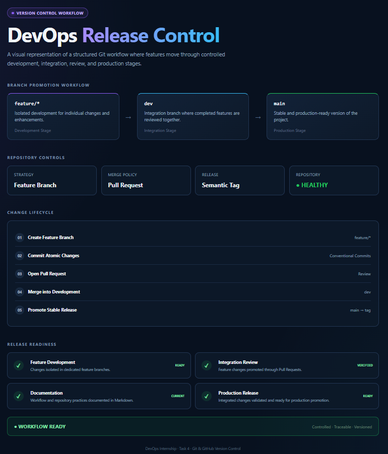
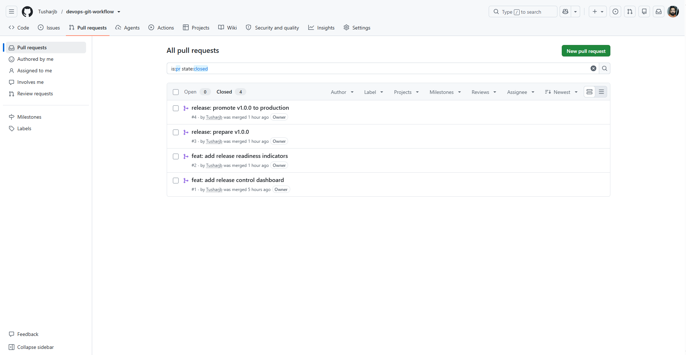
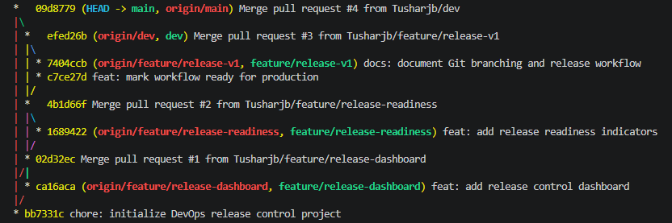
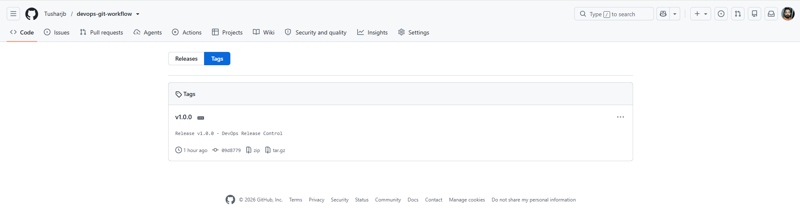

# DevOps Release Control

> A version-controlled DevOps project demonstrating a structured Git and GitHub workflow using feature branches, Pull Requests, atomic commits, documentation, and semantic release tagging.


---

## Project Overview

**DevOps Release Control** is a practical Git workflow project created to demonstrate how changes can move safely from isolated development to integration and finally to production.

Rather than developing directly on the production branch, this repository uses a controlled promotion model:

```text
feature/*  →  dev  →  main  →  v1.0.0
     Pull Request    Pull Request
```

The project demonstrates:

- Git repository initialization and version control
- `main`, `dev`, and dedicated `feature/*` branches
- Feature isolation
- Meaningful and atomic commits
- GitHub Pull Request based merging
- Structured development-to-production promotion
- `.gitignore` configuration
- Markdown workflow documentation
- Git branch history and traceability
- Semantic version tagging

---

## Release Control Dashboard

The project includes a visual dashboard representing the Git release workflow implemented by this repository.



The dashboard represents the same workflow followed during project development:

**Feature Development → Integration → Review → Production → Release**

---

## Branching Strategy

| Branch | Purpose |
|---|---|
| `main` | Stable and production-ready code |
| `dev` | Integration branch for reviewed features |
| `feature/release-dashboard` | Release dashboard development |
| `feature/release-readiness` | Release readiness indicators |
| `feature/release-v1` | Production release preparation |

### Promotion Flow

```text
                    feature/release-dashboard
                              │
                              │ PR #1
                              ▼
                            dev
                              ▲
                              │ PR #2
                              │
                    feature/release-readiness
                              │
                              │
                    feature/release-v1
                              │
                              │ PR #3
                              ▼
                            dev
                              │
                              │ PR #4
                              ▼
                            main
                              │
                              ▼
                           v1.0.0
```

This approach keeps feature development isolated while ensuring that production changes pass through an integration stage first.

---

## Pull Request Workflow

Four Pull Requests were used to move changes through the repository.

| PR | Promotion | Purpose |
|---|---|---|
| `#1` | `feature/release-dashboard → dev` | Introduced the Release Control dashboard |
| `#2` | `feature/release-readiness → dev` | Added release readiness indicators |
| `#3` | `feature/release-v1 → dev` | Prepared and documented the v1 release |
| `#4` | `dev → main` | Promoted the validated release to production |



No feature was directly promoted to `main`. Features first passed through the `dev` integration branch before the production release.

---

## Git History

The repository preserves the feature and Pull Request history using merge commits.



Key commits include:

```text
bb7331c  chore: initialize DevOps release control project
ca16aca  feat: add release control dashboard
02d32ec  Merge pull request #1
1689422  feat: add release readiness indicators
4b1d66f  Merge pull request #2
c7ce27d  feat: mark workflow ready for production
7404ccb  docs: document Git branching and release workflow
efed26b  Merge pull request #3
09d8779  Merge pull request #4
```

This provides a traceable history from initial development through the production release.

---

## Release v1.0.0

The first stable production version is identified using the annotated Git tag:

```text
v1.0.0
```

Tag annotation:

```text
Release v1.0.0 - DevOps Release Control
```



The release tag points to the production state on `main` after the final `dev → main` Pull Request.

---

## Repository Structure

```text
Task-4-Git/
│
├── app/
│   └── index.html
│
├── docs/
│   └── git-workflow.md
│
├── screenshots/
│   ├── application-dashboard.png
│   ├── git-branch-history.png
│   ├── pull-request-workflow.png
│   └── release-tag.png
│
├── .gitignore
└── README.md
```

---

## Git Workflow

### 1. Feature Development

A feature branch is created from the latest `dev` branch.

```bash
git switch dev
git switch -c feature/<feature-name>
```

### 2. Atomic Commit

Changes are staged and committed using a descriptive commit message.

```bash
git add .
git commit -m "feat: describe the change"
```

### 3. Push Feature Branch

```bash
git push -u origin feature/<feature-name>
```

### 4. Pull Request

A GitHub Pull Request promotes the completed feature into:

```text
feature/* → dev
```

### 5. Production Promotion

After integration and validation:

```text
dev → main
```

is completed through a separate Pull Request.

### 6. Release Tagging

The stable production commit is tagged:

```bash
git tag -a v1.0.0 -m "Release v1.0.0 - DevOps Release Control"
git push origin v1.0.0
```

---

## Commit Convention

The project uses concise commit prefixes to make repository history easier to understand.

| Prefix | Usage |
|---|---|
| `feat:` | New functionality |
| `docs:` | Documentation changes |
| `chore:` | Repository setup or maintenance |
| `release:` | Release-related workflow |

Examples:

```text
feat: add release control dashboard
feat: add release readiness indicators
docs: document Git branching and release workflow
chore: initialize DevOps release control project
```

---

## Run the Project

No package installation or external dependency is required.

Clone the repository:

```bash
git clone https://github.com/Tusharjb/devops-git-workflow.git
```

Enter the project:

```bash
cd devops-git-workflow
```

Open:

```text
app/index.html
```

The dashboard runs directly in a modern web browser.

---

## Verification Commands

View available branches:

```bash
git branch -a
```

View the complete Git graph:

```bash
git log --graph --oneline --decorate --all
```

View available release tags:

```bash
git tag
```

Inspect the release:

```bash
git show v1.0.0 --no-patch
```

Check repository status:

```bash
git status
```

---

## Documentation

Detailed workflow documentation is available in:

[`docs/git-workflow.md`](docs/git-workflow.md)

It covers the branch strategy, Pull Request workflow, commit conventions, and release strategy used in this project.

---

## Project Outcome

This project demonstrates a complete version-control lifecycle:

```text
Plan
  ↓
Feature Branch
  ↓
Atomic Commit
  ↓
Pull Request
  ↓
Development Integration
  ↓
Validation
  ↓
Production Pull Request
  ↓
main
  ↓
v1.0.0
```

The resulting repository provides a clear, reviewable, and traceable Git workflow from feature development through production release.

---

**DevOps Internship · Task 4 · Git & GitHub Version Control**